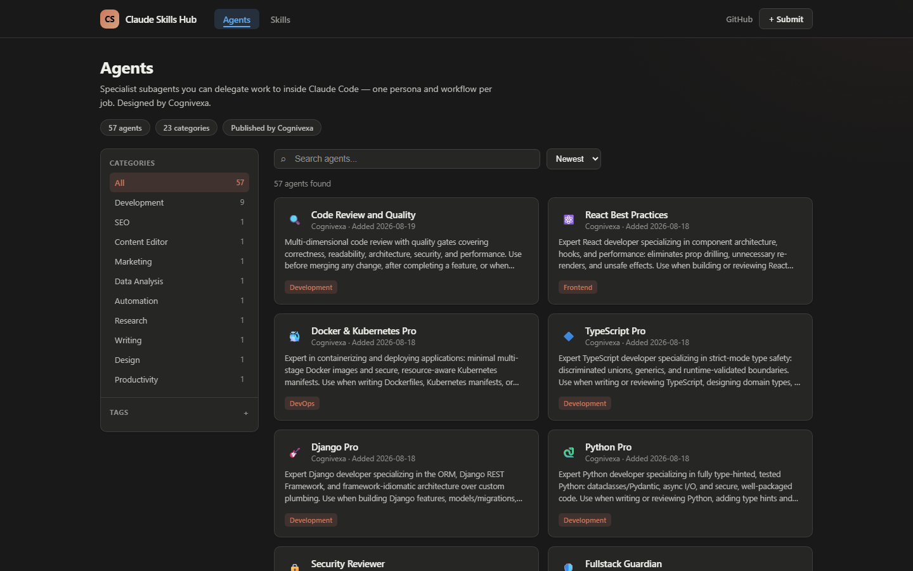
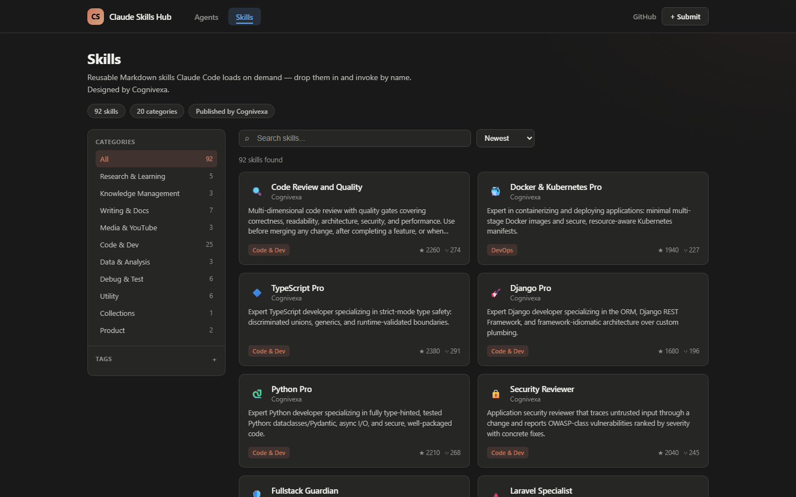
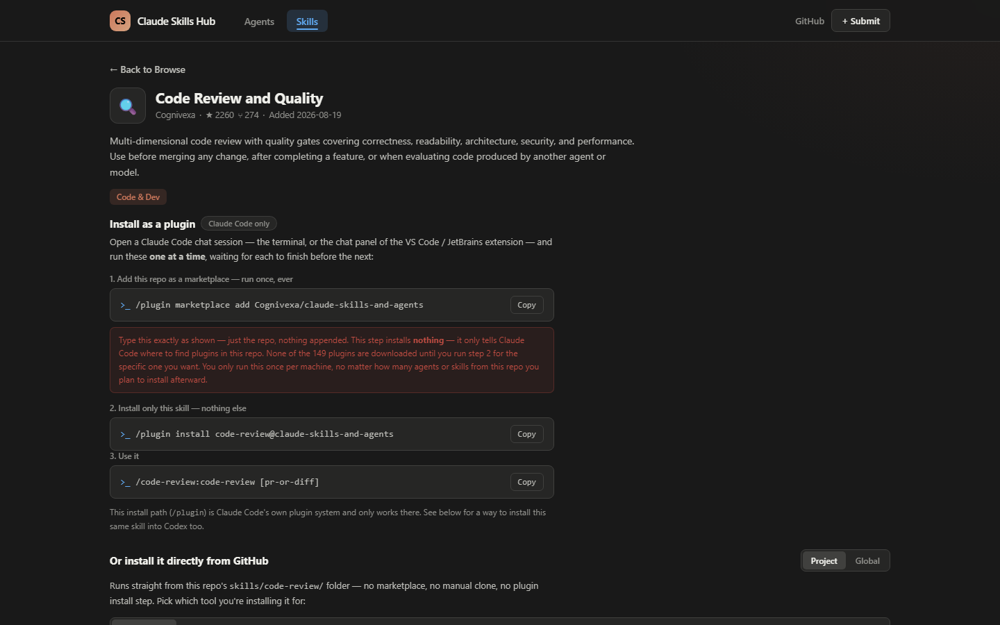
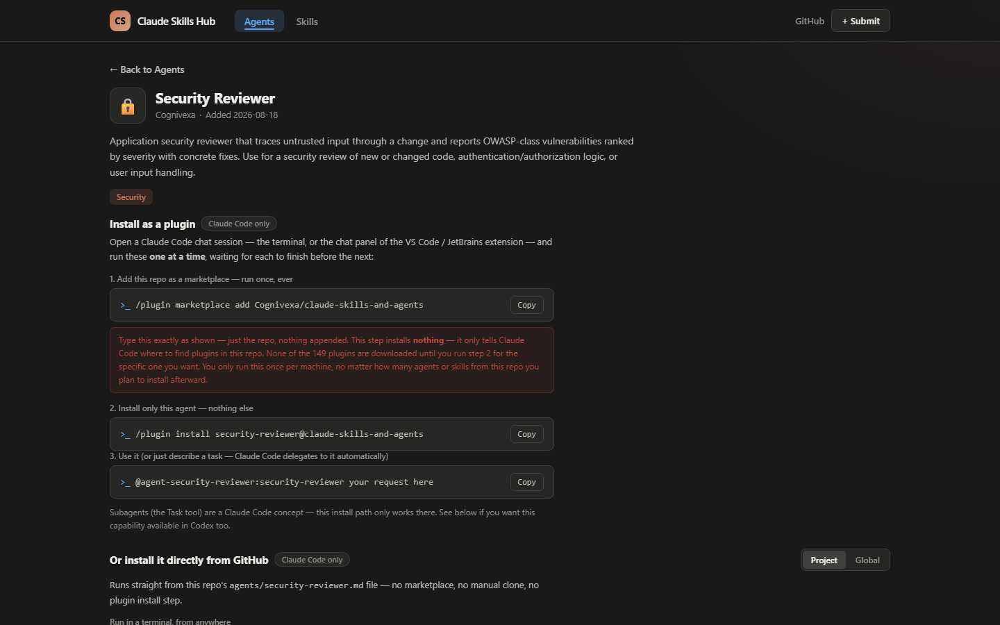

# Claude Skills and Agents

A library of **104 skills**, **75 agents**, and **23 connectors** built by
**Cognivexa** — for Claude Code and Codex — spanning engineering, product,
marketing, SEO, cloud/DevOps, data, and more. A handful of flagship "Pro"
entries (WordPress, PHP, Laravel, Python, Django, TypeScript, Docker &
Kubernetes, React, Fullstack Guardian, Security Reviewer, Code Review and
Quality) ship with real code patterns, MUST-DO / MUST-NOT constraints, and
progressive-disclosure reference docs, not just a short description.

Every skill and agent is designed **offline-first**: it should be fully
useful from a description alone, with no external account ever required
just to get value out of it. A handful reference an optional connector (see
[Connectors](#connectors) below) for when a task genuinely needs live access
to a real account — and even then, the agent asks before assuming that
connector is configured, rather than gating its own advice behind a login
screen.

This is an independent, community project. It is **not affiliated with,
endorsed by, or officially connected to Anthropic or OpenAI**. "Claude",
"Claude Code", "Codex", and "OpenAI" are used here only to describe
compatibility with those products.

A browsable catalog of everything in this repo is included as a small React
app under [`src/`](src/) — run `npm install && npm run dev` to explore it
locally.

## Interface

Browse agents and skills, filter by category or tag, and copy the exact
install command for each — no digging through folders to find what's
available.

| | |
|---|---|
|  |  |
|  |  |

## Two ways to install a skill or agent

Every skill and agent in this repo is a plain Markdown file. There are two
independent ways to get one into Claude Code, and Codex reads the same
skill files as Claude Code (agents are Claude-Code-only — see
[Codex support](#codex-support)):

| Method | Works with | Reliability | Setup |
|---|---|---|---|
| **[A. Copy the folder](#method-a-copy-the-folder-recommended)** | Claude Code + Codex | Works on any version, no network dependency after cloning | One `git clone` + one folder copy |
| **[B. Plugin marketplace](#method-b-plugin-marketplace-claude-code-only)** | Claude Code only | Needs Claude Code v2.1.232+ for reliable re-installs; older versions can serve a stale cached list | Three `/plugin` commands |

**If you only remember one thing:** Method A is what we recommend by
default. It's a plain file copy, so it can't be broken by a marketplace
cache or a Claude Code version mismatch, and it's the only method that also
works in Codex.

## Method A: copy the folder (recommended)

Claude Code scans two folders every session — `.claude/skills/` (this
project only) and `~/.claude/skills/` (every project on this machine) — and
lists anything with a `SKILL.md` inside under `/skills`, using it
automatically when a request matches its description. Codex does the same
thing at `.agents/skills/` (project) and `~/.agents/skills/` (global). This
repo's [`skills/`](skills/) and [`agents/`](agents/) directories are laid out
in exactly the format both tools expect, so "installing" one is just
**copying that one folder**.

**1. Get the repo once:**

```bash
git clone https://github.com/Cognivexa/Claude-Skills-and-Agents.git
```

**2. Copy the skill or agent you want.** Pick your tool and scope:

<details>
<summary><strong>Claude Code</strong></summary>

```powershell
# Windows PowerShell — this project only
Copy-Item -Recurse "Claude-Skills-and-Agents\skills\code-review" ".claude\skills\code-review"

# Windows PowerShell — every project on this machine
Copy-Item -Recurse "Claude-Skills-and-Agents\skills\code-review" "$HOME\.claude\skills\code-review"
```

```bash
# macOS / Linux — this project only
cp -r Claude-Skills-and-Agents/skills/code-review .claude/skills/code-review

# macOS / Linux — every project on this machine
cp -r Claude-Skills-and-Agents/skills/code-review ~/.claude/skills/code-review
```

For an **agent** instead of a skill, copy the single `.md` file from
[`agents/`](agents/) into `.claude/agents/<name>.md` (project) or
`~/.claude/agents/<name>.md` (personal) the same way.

</details>

<details>
<summary><strong>Codex</strong></summary>

```bash
# This project only
cp -r Claude-Skills-and-Agents/skills/code-review .agents/skills/code-review

# Every project on this machine
cp -r Claude-Skills-and-Agents/skills/code-review ~/.agents/skills/code-review
```

Codex doesn't have an equivalent to Claude Code's subagents, so only skills
are installable this way — there's nothing under `agents/` to copy for
Codex.

</details>

**3. Restart once if the destination folder is brand new.** Claude Code and
Codex watch `skills`/`agents` folders that already existed when the session
started; if `.claude/skills/` (or the equivalent) didn't exist before this
copy, restart the session so it starts watching the new folder. If you've
installed anything there before, it's picked up live — no restart needed.

**4. Confirm it shows up.** Run `/skills` in Claude Code (or `/skills` in
Codex) and you'll see it listed alongside anything else you've installed.

**5. Use it:**

* **Claude Code:** type `/code-review` (bare name, no plugin prefix — that's
  only for Method B), or just ask naturally — "review this file" — and
  Claude invokes it automatically because the request matches its
  description.
* **Codex:** mention `$code-review` in your prompt, or run `/skills` to
  browse and select it. Codex also invokes it automatically when a prompt
  matches the description.
* **A Claude Code agent:** Claude delegates to it automatically when a task
  matches its description, or @-mention it explicitly.

## Method B: plugin marketplace (Claude Code only)

This is Claude Code's built-in plugin system. It installs every skill/agent
in this repo as one namespaced plugin, shown in `/plugin` → Installed.

**Step 1 — register this repo as a marketplace (once, ever, per machine):**

```
/plugin marketplace add Cognivexa/claude-skills-and-agents
```

This installs **nothing** by itself — it only tells Claude Code where to
find plugins here. None of the plugins are downloaded until Step 2.

**Step 2 — install one specific agent or skill:**

```
/plugin install <plugin-name>@claude-skills-and-agents
```

Replace `<plugin-name>` with the slug shown on that agent/skill's page in
the catalog (for example, `code-review`, `wordpress-pro`).

**Step 3 — use it:**

```
/plugin-name:skill-name [arguments]          # skills
@agent-plugin-name:agent-name your request   # agents, or just describe the task
```

### If Step 2 says "not found in marketplace"

This means Claude Code is reading a cached copy of this repo's plugin list
from before the plugin you want was added — it happens on Claude Code
versions **before v2.1.232**, which don't auto-refresh a marketplace before
a named install. Fix it with one of these, then retry Step 2:

```
/plugin marketplace update claude-skills-and-agents
```

If that command isn't recognized either:

```
/plugin marketplace remove claude-skills-and-agents
/plugin marketplace add Cognivexa/claude-skills-and-agents
```

Or update Claude Code itself: `npm install -g @anthropic-ai/claude-code@latest`.

### Full worked example

```
/plugin marketplace add Cognivexa/claude-skills-and-agents
/plugin install code-review@claude-skills-and-agents
/code-review:code-review path/to/file.py
```

Don't have Claude Code installed yet? `npm install -g @anthropic-ai/claude-code`,
then run `claude` from a terminal (including VS Code's or JetBrains') to
start a session before using the commands above.

## Codex support

Every skill in [`skills/`](skills/) is written in the open Agent Skills
format both Claude Code and Codex read directly — no conversion needed.
Codex looks for skills in `.agents/skills/` (project, walking up to the repo
root) or `~/.agents/skills/` (global), and invokes one either by mentioning
`$skill-name` in a prompt or automatically when a prompt matches the
skill's description. See [Method A](#method-a-copy-the-folder-recommended)
above for the exact copy commands.

Agents (subagents) are a Claude Code–specific concept with no Codex
equivalent — if you need that capability in Codex, check whether the same
capability also exists as a skill in this repo (most of the flagship "Pro"
agents do, under the same slug) and install that instead.

## Connectors

Connectors are a different kind of thing from a skill or agent: they're real,
third-party **MCP (Model Context Protocol) servers** — running software
Claude talks to — not markdown prompts. Every connector in
[`src/data/connectors.js`](src/data/connectors.js) is a genuine, publicly
documented server operated by its actual vendor (GitHub, Notion, Slack,
Atlassian, Figma, Ahrefs, AWS, Hugging Face, and 15 others) — Cognivexa did
not build any of them and is never credited as their author. What this repo
adds is packaging each as a `.claude-plugin/plugin.json` + `.mcp.json` pair,
so `/plugin install <slug>@claude-skills-and-agents` genuinely registers the
real server — the same install flow as any skill or agent here.

Each connector's page documents three ways to add it: as a plugin from this
repo, directly via `claude mcp add`, or via a `claude_desktop_config.json`
snippet for Claude Desktop — plus the exact credential (API key, token, or
OAuth) it needs, since none of them come pre-authenticated.

**No skill or agent in this catalog requires a connector to be useful.**
Where one is mentioned in an agent's own instructions (e.g. Database
Architect can defer to `postgres-mcp-connector` for a live query), it's
always presented as optional and the agent asks before assuming it's
configured — see the "Optional connection" badge on that agent/skill's page.

## Repository layout

```
.claude-plugin/marketplace.json   marketplace manifest listing every plugin (Method B)
skills/<slug>/SKILL.md            flat skill layout — copy straight into .claude/skills/ or .agents/skills/ (Method A)
skills/<slug>/references/*.md     supporting reference docs for the flagship "Pro" skills
agents/<slug>.md                  flat agent layout — copy straight into .claude/agents/ (Method A, Claude Code only)
plugins/<slug>/                   the same content packaged as Claude Code plugins (Method B)
src/                              browsable catalog (React + Vite)
scripts/generate-marketplace.mjs  regenerates plugins/, skills/, agents/, and marketplace.json from src/data
```

`skills/`, `agents/`, and `plugins/` are all generated from
[`src/data/skills.js`](src/data/skills.js) and
[`src/data/agents.js`](src/data/agents.js) — don't hand-edit the generated
folders directly, since a regeneration overwrites them.

## Adding a new agent or skill

1. Add an entry to `src/data/agents.js` or `src/data/skills.js`.
2. Run `npm run generate:marketplace` to regenerate `plugins/`, `skills/`,
   `agents/`, and `.claude-plugin/marketplace.json` from that data.
3. Commit both the data change and the generated output.

## Categories

**Skills:** Research & Learning, Knowledge Management, Writing & Docs,
Media & YouTube, Code & Dev, Data & Analysis, Debug & Test, Utility,
Collections, Product, Compliance, C-Level Advisory, Business Operations,
Commercial & Finance, DevOps, Security, Mobile Development, Git & Version
Control, AI Engineering, Media & Graphics.

**Agents:** Development, SEO, Content Editor, Marketing, Data Analysis,
Automation, Research, Writing, Design, Productivity, Product, Compliance,
C-Level Advisory, Business Operations, Commercial & Finance, DevOps,
Security, Frontend, UI/UX, AI Engineering, Data Science, Communication,
Other.

## Deploying the catalog site

The `src/` app is a plain static Vite build with no backend, no database,
and no server-side environment variables — so any static host works. This
repo is configured for **Cloudflare Pages**, chosen for its free-tier limits
as of 2026 (unlimited requests and bandwidth for static assets, unlimited
sites, unlimited collaborators) and its direct GitHub integration.

**One-time setup (Cloudflare dashboard):**

1. Go to **Workers & Pages → Create → Pages → Connect to Git**, and select
   this repository.
2. Set the build configuration:
   - **Build command:** `npm run build`
   - **Build output directory:** `dist`
   - **Root directory:** `/` (leave default)
3. No environment variables are required — this is a static build with no
   API keys or secrets baked in.
4. Click **Save and Deploy**.

From then on, every push to the branch you selected (typically `main`)
triggers an automatic build and deploy — Cloudflare shows build logs per
deploy, and the public `*.pages.dev` URL always serves the latest
successful build. A custom domain can be attached later from the same
project's **Custom domains** tab at no extra cost.

[`public/_redirects`](public/_redirects) contains the SPA fallback rule
(`/* /index.html 200`) this app needs — since it's a client-side-routed
React Router app, every path must resolve to `index.html` and let the
router take over, or a direct link to e.g. `/skills/code-review` would 404
on a plain static host. Cloudflare Pages, Netlify, and most static hosts
read this same `_redirects` format natively.

**Alternative hosts** (also free-tier, also support GitHub auto-deploy, if
you'd rather use one of these): Vercel and Netlify both work with the same
build command/output directory above — Netlify reads the same
`_redirects` file; Vercel needs an equivalent rewrite rule in `vercel.json`
instead. GitHub Pages works too but needs the router switched to
`HashRouter` or a base-path adjustment, since it has no native SPA-fallback
mechanism.

## License

All content in this repository is original work authored for this project.

## Developer

Cognivexa
